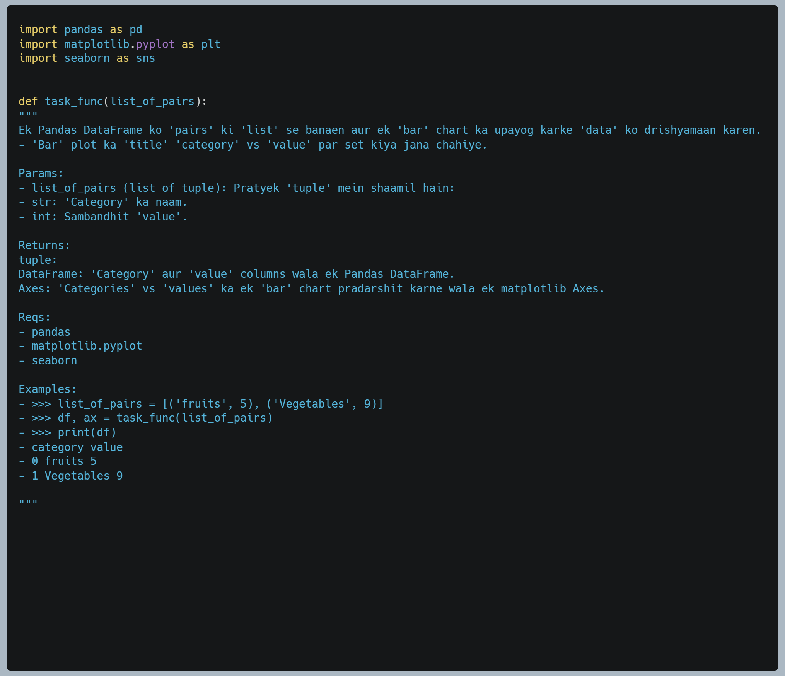

# CodeMixBench: Evaluating Large Language Models on Code Generation with Code-Mixed Prompts

This repository is the official implementation of [CodeMixBench: Evaluating Large Language Models
on Code Generation with Code-Mixed Prompts]().

Built on top of [BigCodeBench](https://huggingface.co/datasets/bigcode/bigcodebench), it introduces 6,840 prompts in three multilingual combinations:
- **Hinglish** (Hindi-English)
- **Spanglish** (Spanish-English)
- **Chinese-English** (Chinese-English)


Each task is augmented at two **Code-Mixing Degree (CMD)** levels: `CMD = 0.6` (light mixing) and `CMD = 0.9` (heavy mixing). The benchmark is designed to reflect real-world multilingual developer interactions and assesses model robustness beyond English-only settings.

CodeMixBench is a multilingual benchmark for evaluating large language models on code generation tasks using code-mixed prompts. Built on top of BigCodeBench, it includes 6,840 prompts across Hinglish, Spanish-English, and Chinese Pinyin-English with controlled code-mixing levels (CMD = 0.6, 0.9).

> Overview of prompt examples in the dataset. 

| **Instruct prompt**                                 | **Complete prompt**                               | **Doc strings**                             |
|:---------------------------------------------------:|:-------------------------------------------------:|:-------------------------------------------:|
|       |     |        |


## 📦 Requirements

We strongly recommend using an isolated environment to avoid conflicts with dependencies.

```bash
pip install -I -r https://raw.githubusercontent.com/bigcode-project/bigcodebench/main/Requirements/requirements-eval.txt
pip install bigcodebench --upgrade
```


## 📈 Evaluation

To evaluate models on CodeMixBench using the BigCodeBench evaluation pipeline, follow the steps below:

### 1. Set Dataset Path

Override the default BigCodeBench dataset path using an environment variable:

```python
import os
os.environ["BIGCODEBENCH_OVERRIDE_PATH"] = "dataset/hindi-eng/MBigCodeBench-hini-end-cmd0.6.jsonl"  # example
```

You have to specify the dataset you are using under `BIGCODEBENCH_OVERRIDE_PATH`.

Refer to Dataset folder, you may need to convert parquet files to jsonl before setting them as an env variable.

### 2. Generate Model Predictions

Use the `generate` command to produce code completions for the selected dataset split:

```bash
bigcodebench.generate \
    --model <model_name_or_path> \
    --split complete \
    --subset full \
    --max_new_tokens=3700
```
> This will generate the code results from the LLM. The generated code samples will be stored in a file named `bcb_results/[model_name]--bigcodebench-[instruct|complete]--[backend]-[temp]-[n_samples]-sanitized_calibrated.jsonl.`

> Replace `<model_name_or_path>` with any Hugging Face model path (e.g., `microsoft/Phi-4-multimodal-instruct`).

### 3. Run Evaluation

After generation, evaluate the model’s outputs using the `evaluate` command:

```bash
bigcodebench.evaluate \
    --execution local \
    --split complete \
    --subset full \
    --samples <path_to_generated_predictions.jsonl> \
    --save_pass_rate
```

The evaluation will generate:
- All the resulted files will be stored in a folder named `bcb_results`
- The evaluation results will be stored in a file named `[model_name]--bigcodebench-complete--[backend]-[temp]-[n_samples]-sanitized_calibrated_eval_results.json`

- The pass@k results will be stored in a file named `[model_name]--bigcodebench-complete--[backend]-[temp]-[n_samples]-sanitized_calibrated_pass_at_k.json`


## ✅ Pre-evaluated Model Results

Previously generated and evaluated results can be found under evals folder, only for hindi-english code-mix combination results are generated and evaluated under both cmd 0.6 and 0.9 levels, with their GAME validation results.

Dataset creation, generation and evaluation code examples are provided as jupyter notebooks under the folder name examples.

> Augmentation steps are under `generation.ipynb` notebook.

> Data evaluation(GAME) steps are under `dataset_eval.ipynb` notebook.

> Model evaluation steps are under `model_eval.ipynb` notebook.

All notebooks have instructions for each step, with their results.

## 📊 Results

### Key Metrics
- **pass@1**: Execution-based metric evaluating whether a generated code sample passes the unit test on the first try.
- **CMD 0.6 / 0.9**: Refers to the level of code-mixing applied to prompts — 0.6 being light and 0.9 being heavy.
- **Original (English)**: Scores on standard BigCodeBench prompts without code-mixing.


| Model                             |   Original (English) %|   CMD 0.6 % |CMD 0.9 %|
|:------------------                |---------------------:|----------:|----------:|
| DeepSeek-R1-Distill-Qwen-1.5B     |                 7.9 |        4.1 |       4.8 |
| StarCoder2-3B                     |                 21.4 |        9.3|       9.1 |
| Llama-3.2-1B                      |                 11.3 |         5 |       4.5 |
| Qwen2.5-Coder-1.5B-Instruct       |                 32.7 |      22.5 |      22.2 |
| Gemma-3-4b-it                     |                 37.8 |      28.2 |      28.4 |
| OpenCoder-8B-Instruct             |                 50.9 |      39.3 |      39.0 |
| Phi-4-multimodal-instruct         |                 46.5 |      30.3 |      33.1 |
| DeepSeek-R1-Distill-Llama-8B      |                 15.3 |      10.0 |      11.1 |
| Hermes-2-Theta-Llama-3-8B         |                 36.4 |      30.3 |      29.1 |
| CodeLlama-7b-Instruct-hf          |                 25.0 |      17.7 |      17.7 |
| Qwen2.5-Coder-7B-Instruct         |                 48.8 |      41.2 |      41.3 |
| Llama-3.1-8B-Instruct             |                 40.5 |      30.7 |      31.4 |
|StarCoder2-7b| 27.7| 6.8| 8.9|
|Phi-4| 55.4| 46.7| 47.1|
|DeepSeek-R1-Distill-Qwen-14B| 48.4| 38.8| 40.3|
|DeepSeek-Coder-V2-Lite-Instruct| 47.6| 37.7| 38.1|
|StarCoder2-15b-instruct-v0.1| 45.1| 33.1| 32.7|
 
# Repository Structure Overview

Below is a one-line description for each directory and file in the CodeMixBench repo:

- **`dataset/`**  
  Contains language-specific subfolders with code-mixed prompts, frequency tables, and GAME scores.

  - **`dataset/chi-eng/`**  
    Chinese-English subset of CodeMixBench.

    - **`game_scores_cmd0.6.parquet`**  
      GAME scores for chi-eng prompts at CMD = 0.6.  
    - **`MBigCodeBench-chi-eng-cmd0.6.parquet`**  
      Lightly code-mixed (CMD 0.6) prompts in Chinese–English.  
    - **`MBigCodeBench-chi-eng-cmd0.9.parquet`**  
      Heavily code-mixed (CMD 0.9) prompts in Chinese–English.  
    - **`word_frequencies_ching.parquet`**  
      Corpus frequencies of Chinese tokens for scoring.

  - similar for the rest of language directories...

- **`bigcodebench_results.csv`**  
  The original English aggregated pass@1 and GAME evaluation results across all models,

- **`eval/`**  
  Model evaluated results for only hindi-english lanugage pair. Having pass@1 and generated results from each of the 17 models across both cmd value pairs. 
  

- **`examples/`**  

  - **`dataset_eval.ipynb`**  
  Jupyter notebook for computing and visualizing GAME scores on code-mixed datasets.

  - **`generation.ipynb`**  
  Notebook demonstrating the Gemini-based translation and CMD injection pipeline.

  - **`model_eval.ipynb`**  
  Notebook for running pass@1 and performance benchmarks on code generation models.

## 📄 License

This project is licensed under the **Apache License 2.0**.  
See the [LICENSE](./LICENSE) file for more details.

## 🙏 Acknowledgments

We would like to express our gratitude to the creators of [BigCodeBench](https://github.com/bigcode-project/bigcodebench) for providing the foundation on which CodeMixBench is built. Our benchmark extends their infrastructure and dataset schema to evaluate code generation under multilingual and code-mixed prompting conditions.

We also thank the open-source community for releasing the large language models used in this evaluation, as well as contributors to tools like Hugging Face Transformers, OpenReview, and the BigCode evaluation suite.

This work would not have been possible without their foundational contributions.
